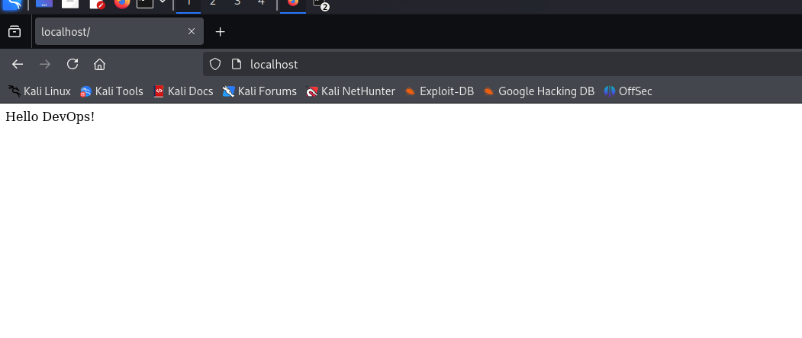

# Node.js Dockerized with Nginx Reverse Proxy

A simple Express.js application containerized with Docker and served through an Nginx reverse proxy.

  
*Figure 1: Application running at localhost*

## Features

- 🐳 Docker containerization
- 🚀 Express.js web server
- 🔄 Nginx reverse proxy
- ♻️ Auto-restart on failure
- 🌐 Port 80 access through Nginx

## Prerequisites

- [Docker Desktop](https://www.docker.com/products/docker-desktop/) (for Windows/Mac)
- [Node.js](https://nodejs.org/) (v14+ recommended)
- [Git](https://git-scm.com/) (optional)

## Installation

1. Clone the repository:
   ```bash
   git clone https://github.com/yvesHakizimana/hakizimana_yves_express_app
   cd hakizimana_yves_express_app
   ```

2. Build and start the containers:
   ```bash
   docker-compose up -d --build
   ```

## Running the Application

### Development Mode
```bash
npm install
npm start
```

### Production Mode (with Docker)
```bash
docker-compose up -d
```

## Accessing the Application

- **Through Nginx proxy**: http://localhost  
    
  *Figure 3: Application accessed through Nginx reverse proxy*

## Project Structure

```
project/
├── Dockerfile          # Node.js container configuration
├── docker-compose.yml  # Multi-container orchestration
├── nginx.conf         # Nginx reverse proxy configuration
├── app.js             # Main application file
├── package.json       # Node.js dependencies
├── screenshot.png     # Application screenshot
└── README.md          # This file
```

## Docker Commands

| Command | Description |
|---------|-------------|
| `docker-compose up -d --build` | Build and start containers |
| `docker-compose down` | Stop and remove containers |
| `docker-compose logs` | View container logs |
| `docker-compose ps` | Check container status |

## Customization

1. **Change Ports**: Modify `docker-compose.yml` to use different ports
2. **Add Environment Variables**: Update `docker-compose.yml` environment section
3. **Modify Nginx Config**: Edit `nginx/nginx.conf` for proxy settings

## Troubleshooting

### Common Issues

1. **Port already in use**:
   - Change ports in `docker-compose.yml`
   - Find and kill processes using `netstat -ano | findstr :<PORT>`

2. **Docker permission errors**:
   - Run Docker as administrator
   - Ensure your drive is shared in Docker settings

3. **Node modules not installing**:
   ```bash
   rm -rf node_modules package-lock.json
   npm install
   ```

## License

[MIT](https://choosealicense.com/licenses/mit/)

---

**Happy Coding!** 🚀